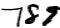
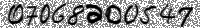
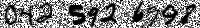

# Image Generation Python Package

## Index:
- [Overview](#overview)
- [Directory Structure](#directory-structure)
- [Specification](#specifications)
- [How to install & run](#how-to-install-and-run)
- [How to install & run using Docker (recommended)](#how-to-install-and-run-using-docker)
- [Automated Test cases](#automated-test-cases)
- [Pylint](#pylint)


## Overview

The goal of this project is to create a Python package that can generate images representing sequences of numbers for data augmentation purposes. These images will be used to train classifiers and generative deep learning models. Additionally, the package should include scripts for generating specific sequences of numbers and creating a dataset of images resembling Japanese phone numbers.

---

## Directory Structure
```
MNIST-digits-sequence/
|-- docs/
|   |-- ProjectReadMe.md
|
|-- resources/
|   |-- train-images-idx3-ubyte
|   |-- train-labels-idx3-ubyte
|
|-- src/
|   |-- __init__.py
|   |-- number-generator-script.py
|   |-- number_generator.py
|
|-- tests/
|   |-- __init__.py
|   |-- conftest.py
|   |-- test_number-generator-script.py
|   |-- test_number_generator.py
|
|-- setup.py
|-- Dockerfile
|-- LICENSE
|-- ReadMe.md 
```
The above directory structure is made, keeping the following things in mind:
- **Clear Separation of Concerns:** Each directory serves a specific purpose. For example, the src directory contains the actual Python source code, the tests directory contains test cases, the docs directory holds documentation, and the resources directory contains resource files. This separation makes it easy to locate and work with different project parts.
- **Modularity:** Organizing the code into packages and modules within the src directory promotes modularity, making it easier to understand, test, and reuse specific functionalities.
- **Testing Support:** The tests directory includes test files and configurations, essential for test-driven development (TDD) and ensuring code correctness.
- **Documentation:** Having a separate docs directory for documentation helps keep the project's documentation organized and accessible.
- **Version Control and Packaging:** The presence of setup.py makes the project installable and distributable using Python packaging tools. It also aids in version management and deployment.
- **Docker Support:** The Dockerfile allows the project to run inside a container, making it more portable and reproducible across different environments.
- **Readability and Maintainability:** A well-structured project is easier to read and maintain, especially as the project grows in size and complexity.

---
## Specifications

### Main Function: `generate_numbers_sequence`
**Location:** `MNIST-digits-sequence/src/number_generator.py`

Generates an image of a sequence, the digits are stacked horizontally, and the spacing between them follows a uniform distribution over a range determined by two user-specified numbers. The user provides the digits themselves, and the system randomly chooses each digit in the generated sequence from one of its representations in the MNIST dataset. The images will have black text on a white background. The user specifies the output image's width in pixels, while the height should be 28 pixels (identical to that of the MNIST digits).

### CLI 1: generate-numbers-sequence
**Location:** `MNIST-digits-sequence/src/number-generator-script.py`
This CLI acts as a low-level command-line interface for the generate_numbers_sequence function. It accepts the following parameters as command-line arguments:
* sequence: The sequence of digits to be generated.
* min_spacing: The minimum spacing between consecutive digits.
* max_spacing: The maximum spacing between consecutive digits.
* image_width: The width of the generated image.
* output_path (optional): The path to store the generated image (default: current directory).

**Note:** The generated image is saved as a .png file. The name of the file will be same as the input sequence provided.

#### Helper Functions:
- `_load_data()`: Loads the MNIST data from a directory containing training images and labels. The MNIST data is present inside the `MNIST-digits-sequence/resources` directory. Function `generate_numbers_sequence()` internally calls the `_load_data()` and saves the loaded images and labels in a global variable during the initial call.
- `_get_image()`: Fetches an image from the global Images list, and performs some processes such as padding removal, inverting the pixels etc.

### CLI 2: generate-phone-numbers
**Location:** `MNIST-digits-sequence/src/number-generator-script.py`
This CLI is used to generate a dataset of images containing random and unique sequences resembling Japanese phone numbers. It accepts the following parameters as command-line arguments:
* min_spacing: The minimum spacing between consecutive digits.
* max_spacing: The maximum spacing between consecutive digits.
* image_width: The width of the generated images.
* num_images: The number of images to generate.
* output_path: The path to store the generated images.

**Note:** The generated images are saved as a .png files. The name of the files will be same as the phone number inside each generated image.

#### Some context to understand `generate-phone-number` CLI's working:
1. A Japanese phone number has 3 different parts:
```text
       090 1234 5678
         \    \    \____ Subscriber number (Part 3): 4 digits
          \    \________ Exchange number (Part 2): 0-4 digits, depending upon the area code
           \____________ Area Code (Part 1): 2-6 digits and usually starts with 0.
```
2. If the area code is (070), (080) or (090) then it is a mobile number, followed by 4 digit exchange number and 4 digit subscriber number. 
3. Possible Phone number patterns:

|  Area Code  | Exchange no.   |  Subscriber no.  | Phone Number Type |
|-------------|----------------|------------------|-------------------|
|    0X       | XXXX           |       XXXX       | Type 1            |
|    0XX      | XXX            |       XXXX       | Type 2            |
|    0XXX     | XX             |       XXXX       | Type 3            |
|    0XXXX    | X              |       XXXX       | Type 4            |
|    0XXXXX   |                |       XXXX       | Type 5            |
|    070      | XXXX           |       XXXX       | Mobile number     |
|    080      | XXXX           |       XXXX       | Mobile number     |
|    090      | XXXX           |       XXXX       | Mobile number     |

4. Writing Styles:
   - **Style 1:** Writing with no part spaces
   
   &nbsp;&nbsp;&nbsp;&nbsp;&nbsp;&nbsp;`Eg: 09012345678, 0839314275`
   - **Style 2:** Writing with part spaces
   
   &nbsp;&nbsp;&nbsp;&nbsp;&nbsp;&nbsp;`Eg: 090 1234 5678, 083 931 4275`

References:
- https://en.wikipedia.org/wiki/Telephone_numbers_in_Japan
- https://en.wikipedia.org/wiki/List_of_dialing_codes_in_Japan
- https://www.globalcallforwarding.com/blog/japan-phone-number-code-explained/
- https://www.reddit.com/r/japanlife/comments/2qzr3v/curious_about_the_format_of_japanese_phone_numbers/

#### Helper Functions:
- **generate_area_code()**: Generates a sequence of area code according the phone number type.
- **generate_exchange_number()**: Generates a sequence of exchange number according to size of area code type.
- **generate_subscriber_number()**: Generates a sequence of 4 digit random subscriber number.
- **combine_phone_number()**: Fetches all the 3 parts of the phone number (area code, exchange number & subscriber number) and generates an image for each part individually. And combines them based of the writing style type.
- **add_noise()**: Add Gaussian noise to an input image.
- **generate_phone_number()**: Main function used by the CLI-2 for generating random Japanese phone numbers. It iteratively generates N number of images by calling the above functions.
---

## How to install and run

### Package installation

**Note:** Recommended Python version >= 3.9

STEP-1: Go inside the project directory:
```commandline
$ cd MNIST-digits-sequence
```

STEP-2: Install all the dependencies:
```commandline
$ pip install -e .
```

STEP-3 (optional): Check if everything is working as expected by running all the test cases:
```commandline
$ python -m pytest
```

### Run

#### 1. To run the main package function `generate_numbers_sequence`:
```commandline
$ python
Python 3.9.17 (main, Jul  5 2023, 15:35:09) 
[Clang 14.0.6 ] :: Anaconda, Inc. on darwin
Type "help", "copyright", "credits" or "license" for more information.
>>> from number_generator import generate_numbers_sequence
>>> seq_image_array = generate_numbers_sequence(digits=[3, 2, 1], spacing_range=(2, 4), image_width=60)
>>> seq_image_array
array([[1., 1., 1., ..., 1., 1., 1.],
       [1., 1., 1., ..., 1., 1., 1.],
       [1., 1., 1., ..., 1., 1., 1.],
       ...,
       [1., 1., 1., ..., 1., 1., 1.],
       [1., 1., 1., ..., 1., 1., 1.],
       [1., 1., 1., ..., 1., 1., 1.]], dtype=float32)
>>> seq_image_array.shape
(28, 60)
```

#### 2. To run CLI-1 `generate-numbers-sequence`:
```commandline
$ python -m number-generator-script generate-numbers-sequence \
--sequence 789 \
--min-space 2 \
--max-space 4 \
--image-width 60 \
--output-path .

INFO:root:Generating the number sequence
INFO:root:Image generated
INFO:root:Saved image path: ./789.png

$ ls
789.png
```
**Output**
<p align="left">
  
</p>

#### 3. To run CLI-2 `generate-phone-numbers`:
```commandline
$ python -m number-generator-script generate-phone-numbers \
--min-space 2 \
--max-space 4 \
--image-width 60 \
--num-images 5 \
--output-path .

INFO:root:Generating 5 random phone numbers
100%|█████████████████████████████████████████████████████████████████████████████████| 5/5 [00:01<00:00,  4.11it/s]
INFO:root:Generated images saved at: .

$ ls
0195613015.png
0224367850.png
07068200547.png
0425926998.png
08044847899.png
```

**Outputs**

<p align="left">
    <br>
    <br>
    <br>
    <br>
    <br>
</p>

---
## How to install and run using Docker
*Recommended

### Building the image

STEP-1: Go inside the project directory:
```commandline
$ cd MNIST-digits-sequence
```

STEP-2: Execute the docker build command:
```commandline
$ docker build -t num-gen-img .

[+] Building 117.5s (14/14) FINISHED                                                                                                                          
 => [internal] load build definition from Dockerfile                                             0.0s
 => => transferring dockerfile: 952B                                                             0.0s
 ... 
 ...
 => exporting to image                                                                           1.4s
 => => exporting layers                                                                          1.4s
 => => writing image sha256:f6c8ad5e09be8c951464e27c8f861ac06f0494e735e117064051b07539854254     0.0s
 => => naming to docker.io/library/num-gen-img                                                   0.0s
```
Here, *num-gen-img* could be any user defined image name. 
The docker image build is made in two stages:
- In the first stage, it will install all the dependencies in a virtual environment and execute the test cases to check if the virtual-env is set up correctly and is working as expected.
- In the second stage (final image), it will copy the virtual environment created in the first stage and only some selected files necessary to execute the package's CLIs.

STEP-2.1: Check if the image is generated:
```commandline
$ docker images

REPOSITORY          TAG       IMAGE ID       CREATED          SIZE
num-gen-img         latest    f6c8ad5e09be   17 minutes ago   1.02GB
```

STEP-3: Run the container:
```commandline
$ docker run --rm num-gen-img

Usage: python -m number-generator-script [OPTIONS] COMMAND [ARGS]...

Options:
  --help  Show this message and exit.

Commands:
  generate-numbers-sequence  Generates an image from input sequence
  generate-phone-numbers     Generates random phone number images
```
If everything installed properly, the container should run the --help argument of the CLI's script.

STEP-4.1: Run the CLI-1 from container:

```commandline
$ docker run --rm -v $PWD/output_images:/container_output/ num-gen-img \
generate-numbers-sequence \
--sequence 123 \
--min-space 2 \
--max-space 4 \
--image-width 100 \
--output-path /container_output

INFO:root:Generating the number sequence
INFO:root:Image generated
INFO:root:Saved image path: /container_output/123.png
```

STEP-4.2 Run the CLI-2 `generate-phone-numbers` from container:
```commandline
$ docker run --rm -v $PWD/output_images:/container_output/ num-gen-img \
generate-phone-numbers \
--num-images 10 \
--min-space 2 \
--max-space 4 \
--image-width 100 \
--output-path /container_output

INFO:root:Generating 10 random phone numbers
100%|██████████| 10/10 [00:03<00:00,  2.59it/s]
INFO:root:Generated images saved at: /container_output
```

**Note:**<br>
In both of the above commands the `-v/--volume` argument in docker run is required to fetch the output from the container to the host machine.<br>
Here, `$PWD/output_images` could be any absolute path where the output should be stored in the host machine.

The container directory `/container_output` is used to for attaching the volume and storing the output from the CLI. <br>
If the user wants to change this parameter, make sure defined container directory in `docker run -v` argument and in the `CLI's --output-path` argument is the same.

It is recommended to use the values of `docker run -v` argument and CLI's `--output-path` argument same as it is mentioned above. All the rest of the arguments can be changed.

---

## Automated Test cases
* **Test case files:** `MNIST-digits-sequence/tests/test_number-generator-script.py`, `MNIST-digits-sequence/tests/test_number_generator.py`
* **Number of test cases:** 21 Test cases
* **Type of test cases:** Unit-tests and Functional tests
* **Run test cases:**
    Go inside the `MNIST-digits-sequence` folder and executing the following command.
     ```commandline
     python -m pytest
     ```
    **Note:** These test cases are also executed in the 1st stage of building the docker file.

### Coverage
```text
Name                                    Stmts   Miss  Cover
-----------------------------------------------------------
setup.py                                    3      3     0%
src/__init__.py                             0      0   100%
src/number-generator-script.py            131     15    89%
src/number_generator.py                    48      0   100%
tests/__init__.py                           0      0   100%
tests/conftest.py                          15      0   100%
tests/test_number-generator-script.py      85      0   100%
tests/test_number_generator.py             56      0   100%
-----------------------------------------------------------
TOTAL                                     338     18    95%
```

---

## Pylint
Pylint score of the main package
```text
************* Module src.number-generator-script
src/number-generator-script.py:150:0: C0301: Line too long (121/120) (line-too-long)
src/number-generator-script.py:212:0: C0301: Line too long (132/120) (line-too-long)
src/number-generator-script.py:234:0: C0301: Line too long (127/120) (line-too-long)
src/number-generator-script.py:237:0: C0301: Line too long (124/120) (line-too-long)
src/number-generator-script.py:277:0: C0301: Line too long (121/120) (line-too-long)
src/number-generator-script.py:1:0: C0103: Module name "number-generator-script" doesn't conform to snake_case naming style (invalid-name)
src/number-generator-script.py:103:0: R0913: Too many arguments (6/5) (too-many-arguments)
src/number-generator-script.py:103:0: R0914: Too many local variables (16/15) (too-many-locals)
src/number-generator-script.py:172:0: R0914: Too many local variables (16/15) (too-many-locals)
src/number-generator-script.py:247:4: W0107: Unnecessary pass statement (unnecessary-pass)
************* Module src.number_generator
src/number_generator.py:73:28: C0121: Comparison '_image == True' should be '_image is True' if checking for the singleton value True, or 'bool(_image)' if testing for truthiness (singleton-comparison)
src/number_generator.py:115:8: W0603: Using the global statement (global-statement)

------------------------------------------------------------------
Your code has been rated at 9.28/10 (previous run: 9.28/10, +0.00)
```

## Future scope of work and enhancements:
- Adding more dataset from [Handwritten numbers and math symbol](https://www.kaggle.com/datasets/xainano/handwrittenmathsymbols) data.
  - This dataset contains more handwritten digits from 0-9.
- Adding new writing style that include country-code and symbols such as '+' and '-' in the generated images. 

  For eg: `+81-090-7400-6239`, `+81-064-286-4687`. The symbols '+' and '-' could be found fom the above dataset.
- Currently, the digits in the images have varying heights and start at different positions on the vertical axis, which makes the generated image look irregular and unrealistic. 
  To make the generated image look more realistic, we need to fix this issue by making sure that all the digits have the similar heights and start at approximately from same position on the vertical axis. This way, the digits will be properly aligned, and the image will appear more organized and natural.  
- We can add backgrounds to the generated image. The background can resemble grids or lines typically seen in a notebook.
